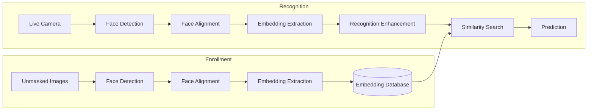
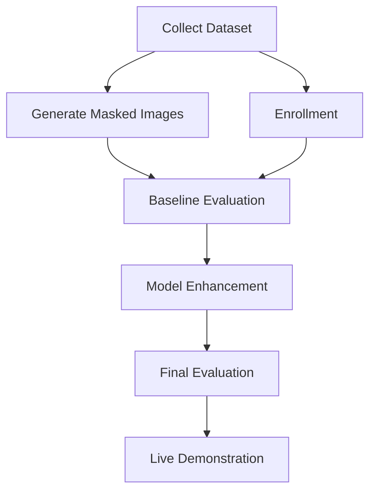

# Project ARGUS

> **Masked Face Recognition using Unmasked Enrollment Gallery**

Project ARGUS is a computer vision system focusing on recognizing individuals wearing face masks using only their previously enrolled **unmasked facial images**.

Unlike conventional face recognition systems that expect both gallery and probe images to be unobstructed, ARGUS addresses the practical scenario where the enrollment database contains unmasked faces while the live input contains partially occluded faces due to masks.

The primary objective is to minimize the recognition performance gap introduced by facial occlusions while maintaining a scalable and real-time recognition pipeline.

---

## Problem Statement

Modern face recognition systems achieve excellent accuracy when both the enrollment gallery and live probe images contain unobstructed faces. However, their performance degrades significantly when the lower half of the face is occluded by a mask.

Project ARGUS aims to bridge this gap by building a recognition pipeline capable of matching masked probe images against an unmasked gallery while maintaining high identification accuracy.

---

## Objectives

- Build a baseline face recognition pipeline using pretrained models.
- Generate masked facial datasets from unmasked images.
- Evaluate the impact of facial occlusion on recognition accuracy.
- Improve masked face recognition through robust training strategies.
- Demonstrate real-time masked face recognition using a webcam.

---

# Features

- Unmasked face enrollment
- Automatic face detection and alignment
- Face embedding generation
- Embedding database
- Similarity-based face matching
- Synthetic mask generation pipeline
- Real-time webcam recognition
- Performance evaluation dashboard
- Extensible architecture for future research

---

# System Overview



---

# System Modules

## 1. Enrollment Module

Responsible for registering new users into the gallery.

Responsibilities

- Capture or import unmasked facial images
- Detect and align faces
- Generate face embeddings
- Store embeddings in the database

---

## 2. Face Detection Module

Detects facial regions from images or video frames before feature extraction.

Responsibilities

- Face localization
- Landmark detection
- Face alignment
- Image normalization

---

## 3. Embedding Generation Module

Converts aligned facial images into numerical feature vectors.

Responsibilities

- Feature extraction
- Embedding normalization
- Identity representation

---

## 4. Recognition Module

Matches incoming probe embeddings against the enrolled gallery.

Responsibilities

- Similarity computation
- Identity prediction
- Confidence estimation
- Unknown face rejection

---

## 5. Evaluation Module

Measures recognition performance using standard face recognition metrics.

Responsibilities

- Rank-1 Accuracy
- Verification Accuracy
- ROC Curve
- TAR @ FAR
- Confusion Matrix

---

# High-Level Methodology



---

# Technology Stack

| Component | Technology |
|------------|------------|
| Language | Python |
| Computer Vision | OpenCV |
| Face Detection | SCRFD (InsightFace) |
| Face Recognition | ArcFace (InsightFace) |
| Deep Learning | PyTorch |
| Vector Database | ChromaDB |
| Numerical Computing | NumPy |
| Visualization | Matplotlib |
| Backend | FastAPI *(planned)* |
| Frontend | Nextjs *(planned)* |

---

# Repository Structure

```text
Project_ARGUS/

├── datasets/
│
├── models/
│
├── training/
│
├── evaluation/
│
├── inference/
│
├── embeddings/
│
├── backend/
│
├── frontend/
│
├── docs/
│
├── README.md
│
└── requirements.txt
```

---

# Datasets

The project uses publicly available datasets for training and evaluation.

| Dataset | Purpose |
|----------|----------|
| LFW | Baseline face recognition |
| MFR2 | Masked face evaluation |
| RMFRD / RMFD | Real masked face recognition |
| MaskedFace-Net | Synthetic masked training |
| MaskTheFace | Synthetic mask generation |

---

# Proposed Enhancements

The baseline pipeline establishes masked face recognition performance using a pretrained ArcFace model with similarity-based matching against an unmasked enrollment gallery. Building upon this baseline, Project ARGUS proposes the following enhancements to improve recognition performance under facial occlusion.

---

## 1. Embedding Refinement Network (Proposed)

A lightweight neural network is proposed to bridge the representation gap between masked and unmasked facial embeddings.

Instead of modifying the pretrained face recognition backbone, the network operates directly on the generated embeddings. During training, corresponding masked and unmasked images of the same individual are passed through the embedding model to generate paired feature vectors. The refinement network learns a transformation that maps masked embeddings closer to their corresponding unmasked representations.

During inference, embeddings extracted from masked probe images are first refined by this network before being matched against the enrollment gallery.

**Expected Benefits**

- Preserves the pretrained ArcFace backbone
- Lightweight and computationally efficient
- Modular architecture that can be integrated into existing recognition pipelines
- Potentially improves masked-to-unmasked matching without retraining the entire recognition model

---

## 2. Fine-Tuning the Recognition Backbone

As a second enhancement, the pretrained ArcFace model will be fine-tuned using a combination of unmasked and synthetically masked facial images.

Synthetic masked samples will be generated using MaskTheFace to expose the model to diverse mask types, colors, and occlusion patterns during training. Fine-tuning aims to improve the robustness of the learned facial representations by encouraging the model to focus on discriminative features that remain visible under occlusion.

The performance of the fine-tuned model will be evaluated against the baseline to quantify the reduction in the masked-to-unmasked generalization gap.

**Expected Benefits**

- Improved robustness to facial occlusions
- Better feature extraction from the visible upper facial region
- Reduced performance degradation when matching masked probe images against an unmasked gallery
- Improved recognition accuracy across varying mask styles and conditions

---

Both enhancements will be evaluated independently against the baseline system using standard face recognition metrics, including Rank-1 Identification Accuracy, ROC-AUC, TAR@FAR, and the masked-to-unmasked generalization gap.

---

# Evaluation Strategy

The system will be evaluated in two stages.

## Baseline

- Unmasked Gallery → Unmasked Probe

This establishes the reference performance of the recognition pipeline.

---

## Masked Evaluation

- Unmasked Gallery → Masked Probe

This measures the degradation caused by facial occlusion.

---

## Metrics

- Rank-1 Identification Accuracy
- 1:1 Verification Accuracy
- ROC-AUC
- TAR @ FAR
- Generalization Gap

---

# Future Scope

- Occlusion-aware embedding learning
- Periocular feature modeling
- Dual-stream feature extraction
- Attention-based recognition
- Edge deployment
- Large-scale watchlist search
- Multi-camera integration

---

# Current Status

| Module | Status |
|----------|--------|
| Literature Study | ✅ |
| System Design | ✅ |
| Dataset Study | ✅ |
| Architecture Design | ✅ |
| Baseline Pipeline | 🟡 In Progress |
| Evaluation Pipeline | 🟡 In Progress |
| Enhancement Pipeline | ⏳ Planned |
| Live Demo | ⏳ Planned |

---

# Team

Project ARGUS is being developed by:

- **Varun Aditya**
- **Rayyan Shaikh Ahmed**
- **Nidhi Mahesh**

---

## Contact

For queries, suggestions, or collaborations, please open an issue in this repository.

---

# License

This repository is intended for academic and research purposes.
