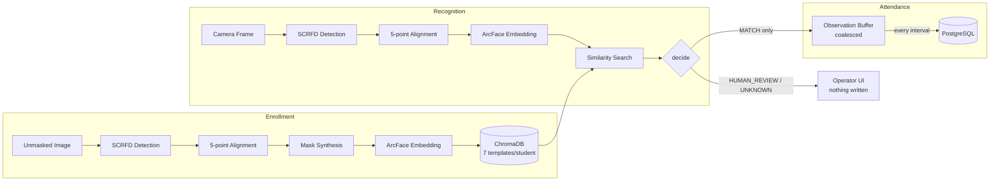

# Project ARGUS

> **Masked Face Recognition using an Unmasked Enrollment Gallery**

Project ARGUS recognises people wearing face masks using only their previously
enrolled **unmasked** facial images, and turns those recognitions into classroom
attendance.

Conventional face recognition expects both the gallery and the probe to be
unobstructed. ARGUS addresses the practical case where the enrollment database
holds unmasked faces while the live camera sees partially occluded ones — and
wraps that recogniser in a complete attendance system: roster management, live
capture, absence derivation and reporting.

**Two things ship in this repository:** a research pipeline that measures how well
masked recognition actually works, and a production-shaped system (FastAPI +
PostgreSQL + ChromaDB + Next.js) that uses it.

---

## Contents

- [Results](#results) — measured accuracy, honestly framed
- [Quick start](#quick-start) — running the whole stack
- [How it works](#how-it-works) — the pipeline end to end
- [Repository layout](#repository-layout)
- [Documentation](#documentation)
- [Technology stack](#technology-stack)
- [Current status](#current-status)
- [Known limitations](#known-limitations)

---

## Results

Baseline: one unmasked embedding per identity as gallery, **zero training**.

| Dataset | Unmasked→unmasked | Masked→unmasked | Generalization gap |
|---|---|---|---|
| LFW subset (400 identities, synthetic masks) | 96.58% | 96.26% | 0.32 pp |
| MFR2 (53 identities, real masks) | 100% | 98.83% | 1.17 pp |

Multi-template gallery matching — one extra template per (identity, mask type),
still zero training:

| Dataset | Baseline rank-1 | Multi-template rank-1 | Gain |
|---|---|---|---|
| LFW subset | 96.26% | 96.61% | +0.35 pp |
| MFR2 | 98.83% | 100% | +1.17 pp |

**Full-scale verification.** Held-out masked probes queried against the complete
5,802-identity demo gallery (8,700 templates) in the live ChromaDB —
a harder test than the above, since every other enrolled identity is a potential
wrong answer: **2,688 / 2,797 = 96.1%** correctly resolved.

> **Read this honestly.** ArcFace/`buffalo_l` is already strongly mask-robust out
> of the box — this is *not* the ~38% TPR drop MaskTheFace's own paper reports for
> FaceNet. The finding is not "we closed a large gap"; it is **"the gap was
> already small, multi-template matching closed most of what remained, and
> RWMFD-style masking is measurably harder than MaskTheFace's"** (both RWMFD
> variants sit 3.7–4.0 pp below every MaskTheFace variant, consistently, across a
> full pipeline re-run). That is a genuine finding, not a disappointing one.

Full breakdowns — per-mask-type numbers, ROC-AUC, TAR@FAR, and the two real bugs
found and fixed mid-pipeline — are in
[`evaluation/accuracy_comparison.md`](evaluation/accuracy_comparison.md) and
[`evaluation/README.md`](evaluation/README.md).

---

## Quick start

### Prerequisites

- **Python 3.11+** (the code uses `enum.StrEnum`)
- **Node.js 20+**
- **PostgreSQL 14+**
- The InsightFace **`buffalo_l`** ONNX pack

### 1. Model weights

The weights are **not in the repository** — the pack is ~197 MB and
`w600k_r50.onnx` alone exceeds GitHub's 100 MB per-file limit, so `models/` is
git-ignored. Download the pack and unpack it so the root looks like this:

```text
models/buffalo_l/
├── det_10g.onnx        detection + 5 landmarks   (used)
├── w600k_r50.onnx      512-d embedding           (used)
├── 2d106det.onnx       dense landmarks           (not used)
└── genderage.onnx      age/gender                (not used)
```

`2d106det.onnx` is unused because the mask synthesiser works in the aligned
canonical frame where the geometry is already known; `genderage.onnx` is not an
attendance concern.

### 2. Backend

```bash
cd backend
python3.11 -m venv .venv && source .venv/bin/activate   # .venv/Scripts/activate on Windows
pip install -r requirements-dev.txt                     # requirements.txt for runtime only
cp .env.example .env                                    # then fill in ARGUS_DATABASE_URL
alembic upgrade head
uvicorn app.main:app --reload
```

Open <http://localhost:8000/docs>. The service **starts even when
half-configured** — every endpoint whose dependency is missing answers `503`
naming the exact environment variable to set, so `GET /health` and `GET /models`
tell you precisely what is left to wire up.

### 3. Frontend

```bash
cd frontend
npm install
cp .env.local.example .env.local        # then point NEXT_PUBLIC_API_URL at the backend
npm run dev                             # http://localhost:3001
```

The backend's `ARGUS_CORS_ORIGINS` must include that origin:

```bash
ARGUS_CORS_ORIGINS=http://localhost:3001
```

### 4. Tests

```bash
cd backend && pytest        # 82 tests, no external services needed
pytest tests/               # 51 tests over the research pipeline, from the repo root
```

The backend suite runs without `onnxruntime`, `chromadb` or PostgreSQL installed —
the vision stack sits behind Protocols and is substituted with fakes.

---

## How it works



Three design decisions define the system:

**1. Enrollment stores masked variants, not just the bare photo.** One unmasked
template plus one per configured mask variant — 7 per student by default — so a
masked probe is compared against masked templates rather than only against a bare
face.

**2. Only a `MATCH` writes attendance.** The decision layer returns `MATCH`,
`HUMAN_REVIEW` or `UNKNOWN`. A nearest neighbour never implies a match (an index
always returns *something*, even for a stranger), a small margin between the top
two identities forces review, and while the thresholds are uncalibrated `MATCH`
is unreachable by construction. No attendance is better than wrong attendance.

**3. Attendance accrues during the lecture; absence is derived once, at the end.**
Recognitions are coalesced in memory and flushed to PostgreSQL once per interval,
so the register fills live. On close, one anti-join statement marks every roster
member without a row as `Absent`. Cost tracks roster size, not detection count.

A per-frame miss rate of ~26% sounds fatal but is not, because attendance samples
every interval: a student present for 20 intervals is missed with probability
~1.5e-12. The design converts a mediocre per-frame recogniser into a reliable
per-lecture one by sampling repeatedly rather than by loosening thresholds.

Full detail — layering, the SQL, the decision policy, scaling behaviour — is in
[`docs/architecture.md`](docs/architecture.md).

---

## Repository layout

```text
Project_ARGUS/
├── backend/          FastAPI service: roster, sessions, capture, recognition
│   ├── app/
│   │   ├── api/          routers + typed dependencies
│   │   ├── services/     use cases, one transaction each
│   │   ├── repositories/ set-based SQL, keyset paging
│   │   ├── recognition/  ports, adapters (scrfd/arcface/masks/chroma), decision
│   │   ├── db/           engine, ORM models (== docs/db.md), integrity mapping
│   │   └── storage/      local filesystem / Cloudflare R2
│   ├── alembic/      0001_initial_schema == docs/db.md
│   ├── benchmarks/   db_scale.py, vector_search.py
│   └── tests/        82 tests
│
├── frontend/         Next.js 16 operator console (10 screens)
│   └── src/          app/ services/ types/ components/ hooks/ store/
│
├── datasets/         raw downloads, processed output, vendored masking tools
│   └── masking/      MaskTheFace + RWMFD + our orchestration scripts
├── embeddings/       batch embedding extraction -> .npz
├── evaluation/       rank-1 / ROC / TAR@FAR, threshold calibration, benchmark tool
├── enrollment/       seeds the 5,802-identity demo gallery into ChromaDB
├── tests/            51 tests over the research pipeline
│
├── models/           buffalo_l ONNX pack (git-ignored — fetch it, see above)
├── samples/          example roster CSV + photo ZIP for bulk import
├── docs/             architecture, API, database, benchmarks, design
├── README.md
└── requirements.txt  research pipeline only; backend pins its own
```

The research half (`datasets/`, `embeddings/`, `evaluation/`, `enrollment/`,
`tests/`) and the serving half (`backend/`, `frontend/`) share the model weights
and the ChromaDB collection schema and nothing else — neither imports the other.

---

## Documentation

| Document | Purpose |
|---|---|
| [`docs/architecture.md`](docs/architecture.md) | **Start here.** How the codebase fits together: layering, the recognition and attendance paths, stores, scaling, testing, limitations |
| [`docs/api_integration.md`](docs/api_integration.md) | HTTP/WebSocket contract for frontends and recognition clients |
| [`docs/database_setup.md`](docs/database_setup.md) | Connection strings, schema mapping decisions, ChromaDB and R2 setup |
| [`docs/db.md`](docs/db.md) | The schema contract — mapped 1:1, no extra tables |
| [`docs/design.md`](docs/design.md) | Detailed design and decision rationale |
| [`docs/registration_import.md`](docs/registration_import.md) | Bulk roster registration from CSV + ZIP |
| [`docs/benchmarks.md`](docs/benchmarks.md) | Measured attendance and vector-search performance at 20,000 students |
| [`docs/scalability_design.md`](docs/scalability_design.md) | Polyglot persistence, buffering and DI rationale |
| [`docs/testplan.md`](docs/testplan.md) | Acceptance test plan |
| [`docs/third_party.md`](docs/third_party.md) | Third-party libraries and tools |
| [`backend/README.md`](backend/README.md) | Running the service, layout, plugging in model adapters |
| [`frontend/README.md`](frontend/README.md) | Running the console, screens, API usage |
| [`evaluation/README.md`](evaluation/README.md) | Methodology, per-mask-type results, bugs found |
| [`enrollment/README.md`](enrollment/README.md) | How the demo gallery was seeded and verified |
| [`datasets/README.md`](datasets/README.md) | Dataset provenance and the masking pipeline |

---

## Technology stack

| Component | Technology |
|---|---|
| Backend | FastAPI, Pydantic v2, Uvicorn |
| Database | PostgreSQL 14+, SQLAlchemy 2 (async), Alembic |
| Vector database | ChromaDB (cosine) |
| Object storage | Cloudflare R2, or a local directory in development |
| Face detection | SCRFD (`det_10g.onnx`) via `onnxruntime` |
| Face recognition | ArcFace (`w600k_r50.onnx`, 512-d) via `onnxruntime` |
| Mask synthesis | Geometric, in the aligned frame (serving) · MaskTheFace + RWMFD (research) |
| Computer vision | OpenCV, NumPy |
| Evaluation | scikit-learn, Matplotlib |
| Frontend | Next.js 16 (App Router), React 19, TypeScript |
| UI | Tailwind CSS v4, Radix UI, TanStack Query, Zustand, Recharts |

Serving runs on `onnxruntime` alone — **no torch and no `insightface` package at
serving time**. Those are research-pipeline dependencies only.

---

## Current status

| Module | Status |
|---|---|
| Literature study, system design, dataset study | Done |
| Synthetic masking pipeline (MaskTheFace + RWMFD) | Done |
| Baseline evaluation (rank-1, ROC-AUC, TAR@FAR) | Done |
| Multi-template gallery matching | Done |
| Attendance backend (roster, sessions, capture, absence) | Done |
| Model adapters (SCRFD / ArcFace / mask synthesis / Chroma) | Done |
| Bulk roster import (CSV + ZIP) | Done |
| Demo gallery seeded (5,802 identities, 8,700 templates) | Done · 96.1% verified |
| Threshold calibration | Done on LFW/MFR2 — **re-calibrate for a real cohort** |
| Frontend operator console (10 screens) | Done |
| Offline runs (recorded video, image archive) | Done |
| Benchmarks at 20,000 students | Done |
| Masked-face **detection** recall | **Open — see limitations** |
| ArcFace fine-tuning | Explored, then abandoned (near-ceiling baseline) |

---

## Known limitations

Stated plainly, because a README that hides these is worse than none.

- **Masked-face detection recall is the real bottleneck, not recognition.** A
  mask occludes half the face, so SCRFD scores a masked student far lower than a
  bare one. Measured on 72 masked faces at classroom scale (~140 px): the library
  default gate of 0.50 detects only **13.9%**; the configured 0.20 detects
  **69.4%**. A face that is never *detected* produces no observation, so a student
  who sat through the whole lecture silently falls through to `Absent`. Lowering
  the gate cannot create false attendance — a detection still has to clear the
  match threshold, and 0 wrong matches were measured at 0.20 — but 69.4% is a
  mitigation, not a fix. The real fix is enrolling masked templates per student:
  data, not code.
- **Thresholds are dataset-derived.** Calibrated on LFW/MFR2 with synthetic masks,
  not on a real cohort, camera or mask-wearing habits. Re-calibrate before
  production.
- **No authentication.** `docs/db.md` declares no users table, so the API is
  unauthenticated and must sit behind a gateway or a private network.
- **The attendance buffer is single-process.** Multiple workers each buffer their
  own observations — correct (they converge via the same merge rule) but
  duplicated — and a hard process kill loses at most one interval of un-flushed
  observations.
- **`roll_no` is an integer and globally unique**, per the schema, so
  alphanumeric roll numbers like `CS2024001` cannot be stored and two classrooms
  cannot reuse a number.
- **Deleting a student destroys their attendance history**, because the foreign
  keys carry no `ON DELETE` rule and the row cannot go otherwise.

---

## Future scope

- Enrolling real masked templates per student (the detection-recall fix)
- Occlusion-aware embedding learning; periocular feature modelling
- Dual-stream feature extraction; attention-based recognition
- Redis-backed capture buffer for horizontal scaling
- Edge deployment, multi-camera integration, large-scale watchlist search

---

## Team

- **Varun Aditya**
- **Rayyan Shaikh Ahmed**
- **Nidhi Mahesh**

For queries, suggestions, or collaborations, please open an issue.

---

## License

This repository is intended for academic and research purposes.
