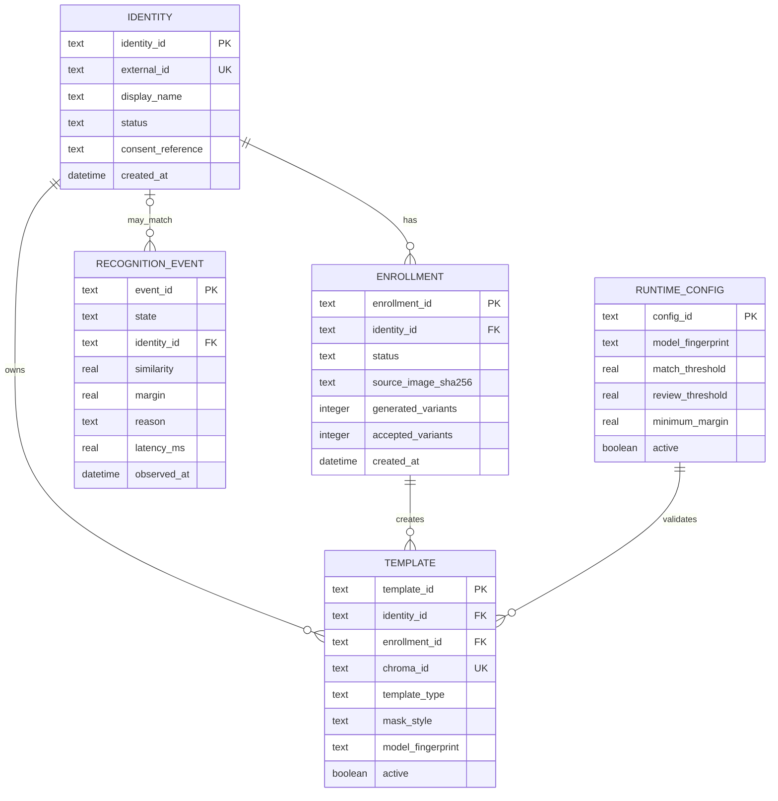

# ARGUS — Database Design

## Why ARGUS Uses Two Databases

ARGUS uses PostgreSQL and Chroma because they serve different purposes.

- **PostgreSQL** stores identities, enrollments, template metadata, recognition events, and audit logs.
- **Chroma** stores ArcFace embeddings and performs vector similarity search.

```text
PostgreSQL
├── People
├── Enrollments
├── Template records
├── Recognition events
└── Audit trail

Chroma
└── ArcFace vectors and similarity search
```

---

# Database Relationships



---

# PostgreSQL Tables

## `identities`

```sql
CREATE TABLE identities (
    identity_id TEXT PRIMARY KEY,
    external_id TEXT NOT NULL UNIQUE,
    display_name TEXT NOT NULL,
    status TEXT NOT NULL
        CHECK (status IN ('ACTIVE', 'DISABLED', 'DELETED')),
    consent_reference TEXT NOT NULL,
    notes TEXT,
    created_at TEXT NOT NULL,
    updated_at TEXT NOT NULL
);
```

---

## `enrollments`

```sql
CREATE TABLE enrollments (
    enrollment_id TEXT PRIMARY KEY,
    identity_id TEXT NOT NULL,
    status TEXT NOT NULL
        CHECK (status IN ('PENDING', 'ACTIVE', 'FAILED', 'DELETED')),
    source_image_sha256 TEXT NOT NULL,
    source_image_retained INTEGER NOT NULL DEFAULT 0,
    source_image_path TEXT,
    detection_score REAL,
    quality_score REAL,
    generated_variant_count INTEGER NOT NULL DEFAULT 0,
    accepted_variant_count INTEGER NOT NULL DEFAULT 0,
    failure_reason TEXT,
    created_at TEXT NOT NULL,
    completed_at TEXT,

    FOREIGN KEY (identity_id)
        REFERENCES identities(identity_id)
);
```

---

## `templates`

```sql
CREATE TABLE templates (
    template_id TEXT PRIMARY KEY,
    identity_id TEXT NOT NULL,
    enrollment_id TEXT NOT NULL,
    chroma_id TEXT NOT NULL UNIQUE,

    template_type TEXT NOT NULL
        CHECK (template_type IN ('UNMASKED', 'SYNTHETIC_MASK')),

    mask_style TEXT,
    vector_dimension INTEGER NOT NULL
        CHECK (vector_dimension = 512),

    quality_score REAL,
    embedding_norm REAL NOT NULL,
    model_fingerprint TEXT NOT NULL,
    vector_sha256 TEXT NOT NULL,

    active INTEGER NOT NULL DEFAULT 1,
    created_at TEXT NOT NULL,

    FOREIGN KEY (identity_id)
        REFERENCES identities(identity_id),

    FOREIGN KEY (enrollment_id)
        REFERENCES enrollments(enrollment_id)
);
```

Example:

```text
template-01 | person-001 | UNMASKED       | NULL
template-02 | person-001 | SYNTHETIC_MASK | surgical_blue
template-03 | person-001 | SYNTHETIC_MASK | cloth_black
```

---

## `runtime_configs`

```sql
CREATE TABLE runtime_configs (
    config_id TEXT PRIMARY KEY,
    model_id TEXT NOT NULL,
    model_fingerprint TEXT NOT NULL,
    detector_fingerprint TEXT NOT NULL,

    embedding_dimension INTEGER NOT NULL
        CHECK (embedding_dimension = 512),

    match_threshold REAL,
    review_threshold REAL,
    minimum_margin REAL,

    calibration_report_sha256 TEXT,
    active INTEGER NOT NULL DEFAULT 0,
    created_at TEXT NOT NULL
);
```

---

## `recognition_events`

```sql
CREATE TABLE recognition_events (
    event_id TEXT PRIMARY KEY,
    request_id TEXT NOT NULL,
    observed_at TEXT NOT NULL,

    state TEXT NOT NULL
        CHECK (state IN ('MATCH', 'HUMAN_REVIEW', 'UNKNOWN')),

    identity_id TEXT,
    review_candidate_id TEXT,

    similarity REAL,
    second_best_similarity REAL,
    margin REAL,

    matched_template_type TEXT,
    matched_mask_style TEXT,
    detection_score REAL,

    face_width INTEGER,
    face_height INTEGER,
    reason TEXT NOT NULL,
    latency_ms REAL NOT NULL,

    FOREIGN KEY (identity_id)
        REFERENCES identities(identity_id)
);
```

---

## `audit_events`

```sql
CREATE TABLE audit_events (
    sequence INTEGER PRIMARY KEY AUTOINCREMENT,
    occurred_at TEXT NOT NULL,
    event_type TEXT NOT NULL,
    actor TEXT NOT NULL,
    subject_id TEXT,
    payload_json TEXT NOT NULL,
    previous_hash TEXT NOT NULL,
    event_hash TEXT NOT NULL UNIQUE
);
```

Typical audit events:

- Person registered
- Enrollment failed
- Person deleted
- Model updated
- Threshold updated
- Database restored
- Audit chain verified

---

# Chroma Collection

## Collection

```text
argus_identity_templates_v1
```

## Configuration

```text
Distance metric: cosine
Vector size: 512
Embedding function: none
Persistence: enabled
```

## Example Record

```json
{
  "id": "template-02",
  "embedding": ["512 float32 values"],
  "metadata": {
    "identity_id": "person-001",
    "enrollment_id": "enrollment-01",
    "template_type": "SYNTHETIC_MASK",
    "mask_style": "surgical_blue",
    "model_fingerprint": "sha256:model-hash",
    "active": true
  }
}
```

---

# Enrollment Transaction

```text
1. Create PENDING enrollment in PostgreSQL
2. Generate original embedding
3. Generate synthetic embeddings
4. Store embeddings in Chroma
5. Store template metadata in PostgreSQL
6. Mark enrollment ACTIVE
```

On failure:

```text
1. Remove inserted Chroma vectors
2. Mark enrollment FAILED
3. Record failure reason
4. Add audit event
```

---

# Deleting an Identity

```text
1. Mark identity DISABLED
2. Retrieve template IDs
3. Delete vectors from Chroma
4. Mark templates inactive
5. Remove retained photographs
6. Mark identity DELETED
7. Add audit event
```

---

# Search Design

Chroma searches **templates**, not **identities**. Since one identity can have multiple templates, ARGUS requests additional template matches before grouping results by identity.

Example:

```text
Requested identities: 5
Maximum templates/person: 7
Chroma templates requested: 50
```

After retrieval:

1. Group templates by identity.
2. Keep the highest-scoring template for each identity.
3. Rank identities by similarity.
4. Apply the decision thresholds.