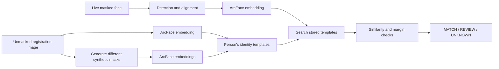
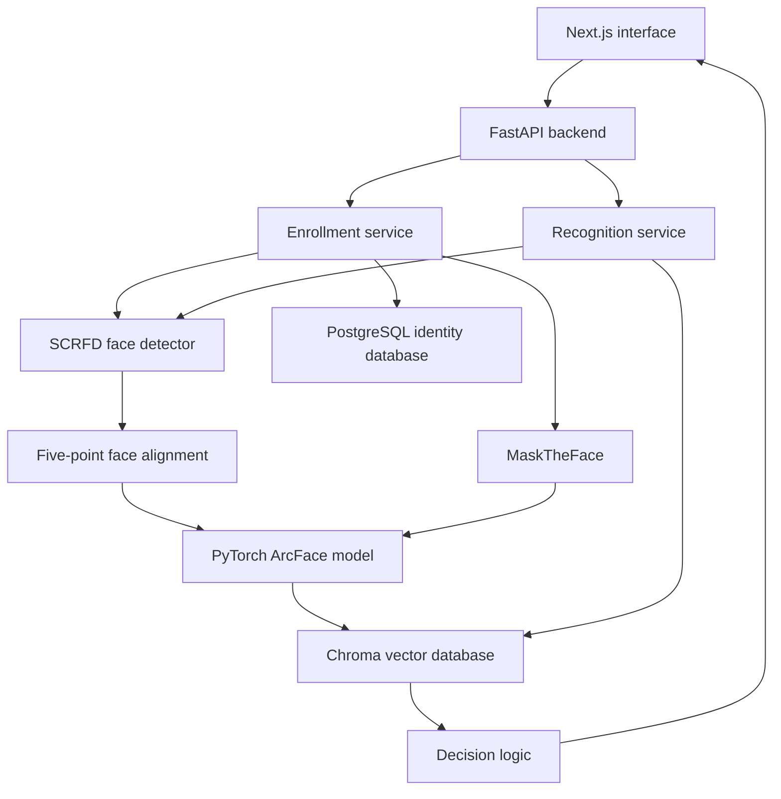

# ARGUS --- Detailed Design

## What we are building

ARGUS recognizes a masked person from an enrollment photograph taken
without a mask.

The main difficulty is that ArcFace does not produce exactly the same
embedding when part of the face is covered. Our approach is to create
several masked versions of the registration photograph and store their
embeddings alongside the original embedding.

We are not trying to reconstruct the hidden nose or mouth. We are giving
the gallery examples of how the same person's embedding changes when
different masks cover the lower face.

------------------------------------------------------------------------

## Core Flow



For evaluation, we keep two modes:

1.  **Official baseline:** masked probe searched against unmasked
    templates only.
2.  **ARGUS system:** masked probe searched against unmasked and
    synthetic-mask templates.

------------------------------------------------------------------------

## Main Components



### Why each component exists

  -----------------------------------------------------------------------
  Component                           Responsibility
  ----------------------------------- -----------------------------------
  SCRFD                               Finds faces and facial landmarks

  Face alignment                      Places every face in the same
                                      reference position

  ArcFace                             Converts an aligned face into a
                                      512-value embedding

  MaskTheFace                         Creates masked versions of an
                                      enrollment photograph

  Chroma                              Searches stored embeddings using
                                      cosine distance

  PostgreSQL                          Stores identities, enrollments,
                                      events and template metadata

  FastAPI                             Connects the interface, models and
                                      databases

  Pydantic                            Checks all API data before it
                                      reaches the system

  Next.js                             Provides registration, live
                                      recognition and reporting screens
  -----------------------------------------------------------------------

------------------------------------------------------------------------

# Enrollment

## Expected input

A registration request contains:

-   A unique person ID.
-   A display name.
-   One clear, unmasked photograph.
-   Confirmation that the person has consented to enrollment.

The system accepts JPEG and PNG files only.

------------------------------------------------------------------------

## Enrollment steps

### 1. Validate the upload

FastAPI checks:

-   File size.
-   File type.
-   Whether the image can actually be decoded.
-   Maximum image dimensions.
-   Required identity fields.

A file named `.jpg` is not trusted simply because of its extension.
OpenCV must be able to decode it successfully.

### 2. Detect the face

SCRFD detects faces and returns:

-   Bounding box.
-   Detection score.
-   Left eye.
-   Right eye.
-   Nose.
-   Left mouth corner.
-   Right mouth corner.

Registration requires exactly one face.

  Situation            Result
  -------------------- ----------------------------------------------
  No face              Reject registration
  More than one face   Ask the user to submit a single-person image
  Very small face      Ask for a closer image
  Blurred face         Ask for a clearer image
  One clear face       Continue

### 3. Align the face

The five landmarks are used to rotate and scale the face into the
standard ArcFace position.

This step matters because embeddings become less reliable when faces are
cropped or rotated differently.

### 4. Generate the unmasked embedding

The aligned image is passed through ArcFace.

``` text
Input: aligned face image
Output: 512 float values
```

The resulting vector is L2-normalized before storage.

This is the person's primary template and is labelled:

``` text
template_type = UNMASKED
```

### 5. Generate masked versions

MaskTheFace creates a fixed set of variations.

Initial configuration:

``` yaml
synthetic_masks:
  variants:
    - surgical_blue
    - surgical_white
    - cloth_black
    - cloth_colored
    - n95
    - improper_low
```

### 6. Generate masked embeddings

Every generated image passes through the same alignment and ArcFace
pipeline.

Example templates:

``` text
person-001 / UNMASKED
person-001 / SURGICAL_BLUE
person-001 / SURGICAL_WHITE
person-001 / CLOTH_BLACK
person-001 / CLOTH_COLORED
person-001 / N95
person-001 / IMPROPER_LOW
```

### 7. Store the enrollment

PostgreSQL stores the person and template information.

Chroma stores the actual 512-dimensional vectors.

The enrollment becomes active only after both databases are updated
successfully.

------------------------------------------------------------------------

## Enrollment failure handling

Mask generation is allowed to partially fail.

For example:

``` text
Original embedding: created
Synthetic variants requested: 6
Synthetic variants created: 5
Failed variant: N95
```

The enrollment is rejected completely if the original unmasked template
cannot be created.

------------------------------------------------------------------------

# Live Recognition

## Frame handling

The browser captures webcam frames and sends them to FastAPI through a
WebSocket.

To avoid creating a queue of old frames:

-   The browser sends one frame.
-   It waits for the result.
-   It then sends the next frame.

The target rate is approximately 5--8 processed frames per second.

The original camera frames are not stored.

------------------------------------------------------------------------

## Recognition steps

### 1. Detect every face

SCRFD processes the frame and returns all detected faces.

Unlike enrollment, live recognition supports multiple faces.

### 2. Align each face

Every detected face is aligned independently.

### 3. Generate the probe embedding

Each aligned face is passed through the same ArcFace model used during
enrollment.

### 4. Search Chroma

The normalized 512-D probe embedding is sent directly to Chroma.

Chroma returns the nearest templates and their cosine distances.

### 5. Convert distance to similarity

The Chroma collection uses cosine distance:

``` text
similarity = 1 - cosine_distance
```

A higher similarity means the embeddings are closer.

### 6. Group templates by person

Chroma searches templates, but ARGUS recognizes identities.

Example Chroma result:

``` text
Rayyan / surgical_blue / 0.71
Rayyan / unmasked       / 0.65
Varun  / cloth_black    / 0.57
Nidhi  / unmasked       / 0.52
```

ARGUS groups the results:

``` text
Rayyan = 0.71
Varun  = 0.57
Nidhi  = 0.52
```

------------------------------------------------------------------------

# Decision Logic

Let:

``` text
s1 = similarity of the best identity
s2 = similarity of the second-best identity
margin = s1 - s2
```

Three thresholds are calibrated using the validation set:

``` yaml
matching:
  match_threshold: null
  review_threshold: null
  minimum_margin: null
```

The values remain `null` until real validation has been completed.

## MATCH

``` text
s1 >= match_threshold
AND
margin >= minimum_margin
```

## HUMAN_REVIEW

Used when the best candidate is plausible but not reliable enough for an
automatic match.

Examples:

-   Similarity passes the review threshold but not the match threshold.
-   The best two identities are too close.
-   The face is small or slightly blurred.
-   Final calibration is not available.

## UNKNOWN

Used when:

-   Similarity is below the review threshold.
-   The gallery is empty.
-   No usable face is detected.
-   The embedding cannot be generated.
-   The probe does not resemble any enrolled identity.

Nearest-neighbour search must never automatically mean `MATCH`. Chroma
will always return the closest vector, even for a stranger.

------------------------------------------------------------------------

# Example Result

``` json
{
  "request_id": "req-b7a91",
  "frame_id": "frame-0042",
  "faces": [
    {
      "bbox": [104, 53, 221, 194],
      "confidence_score": 0.97,
      "result": "MATCH",
      "display_name": "Rayyan",
      "similarity": 0.71,
      "remarks": "Similarity and identity margin passed validation thresholds"
    },
    {
      "bbox": [310, 66, 421, 193],
      "confidence_score": 0.94,
      "result": "UNKNOWN",
      "display_name": null,
      "similarity": 0.31,
      "remarks": "No enrolled identity reached the review threshold"
    }
  ]
}
```

------------------------------------------------------------------------

# API Design

## Runtime

``` text
GET /api/v1/health
GET /api/v1/runtime
GET /api/v1/models
```

## Identities

``` text
GET    /api/v1/identities
POST   /api/v1/identities
GET    /api/v1/identities/{identity_id}
DELETE /api/v1/identities/{identity_id}
```

## Enrollment

``` text
POST /api/v1/identities/{identity_id}/enroll
GET  /api/v1/identities/{identity_id}/templates
```

## Recognition

``` text
POST /api/v1/recognize
WS   /api/v1/live
```

## Evidence

``` text
GET /api/v1/events
GET /api/v1/reports
GET /api/v1/audit/status
```

------------------------------------------------------------------------

# Pydantic Response Models

``` python
from typing import Literal
from pydantic import BaseModel, Field

DecisionState = Literal["MATCH", "HUMAN_REVIEW", "UNKNOWN"]

class Candidate(BaseModel):
    identity_id: str
    display_name: str
    similarity: float = Field(ge=-1.0, le=1.0)

class FaceDecision(BaseModel):
    bbox: tuple[int, int, int, int]
    detection_score: float = Field(ge=0.0, le=1.0)
    state: DecisionState
    identity_id: str | None = None
    display_name: str | None = None
    similarity: float | None = Field(default=None, ge=-1.0, le=1.0)
    second_best_similarity: float | None = None
    margin: float | None = None
    matched_template: str | None = None
    reason: str
    candidates: list[Candidate] = []

class FrameResult(BaseModel):
    request_id: str
    frame_id: str
    latency_ms: float = Field(ge=0)
    faces: list[FaceDecision]
```

------------------------------------------------------------------------

# Evaluation

We evaluate two systems separately.

## Required baseline

``` text
Unmasked gallery → Unmasked probes
Unmasked gallery → Masked probes
```

## ARGUS template system

``` text
Unmasked + synthetic-mask gallery → Masked probes
```

## Reported measurements

-   Rank-1 identification accuracy.
-   Rank-5 identification accuracy.
-   ROC-AUC.
-   TAR at selected FAR values.
-   Unmasked-to-masked accuracy gap.
-   Accuracy by mask style.
-   Stranger rejection rate.
-   `HUMAN_REVIEW` rate.
-   Detection success rate.
-   Average and p95 latency.
-   Frames per second.
-   CPU, GPU and memory usage.

------------------------------------------------------------------------

# When the Product Is Considered Working

The first working release must demonstrate:

1.  Register a person using one unmasked photograph.
2.  Create the original ArcFace template.
3.  Create synthetic masked templates.
4.  Persist the templates after restart.
5.  Recognize the registered person while masked.
6.  Return `UNKNOWN` for a stranger.
7.  Return `HUMAN_REVIEW` for an ambiguous result.
8.  Process multiple faces in one frame.
9.  Delete an identity and all associated vectors.
10. Operate without an internet connection.
11. Fail clearly when a model or database is unavailable.
12. Report the unmasked-only baseline separately from the synthetic-template system.
